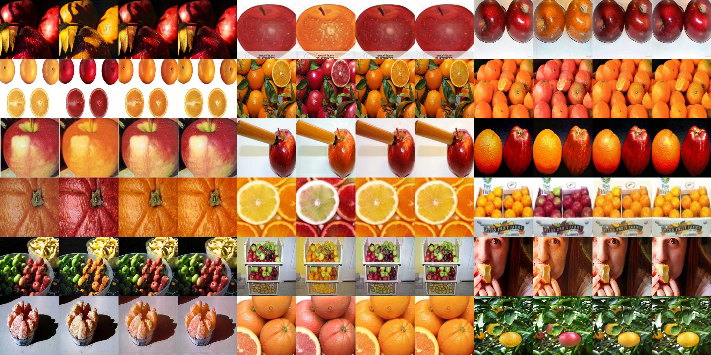
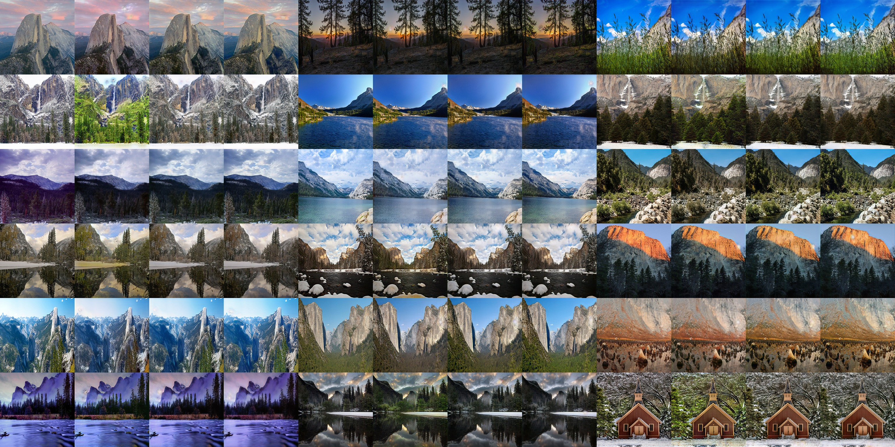
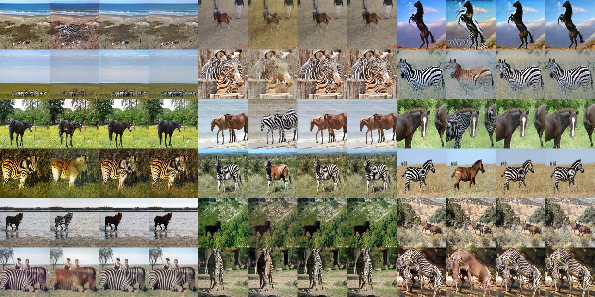
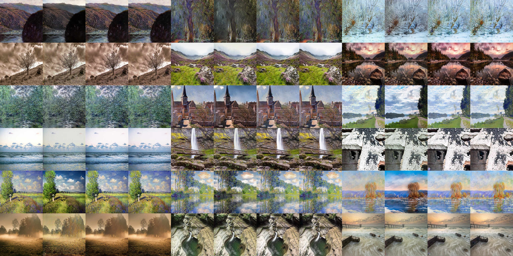
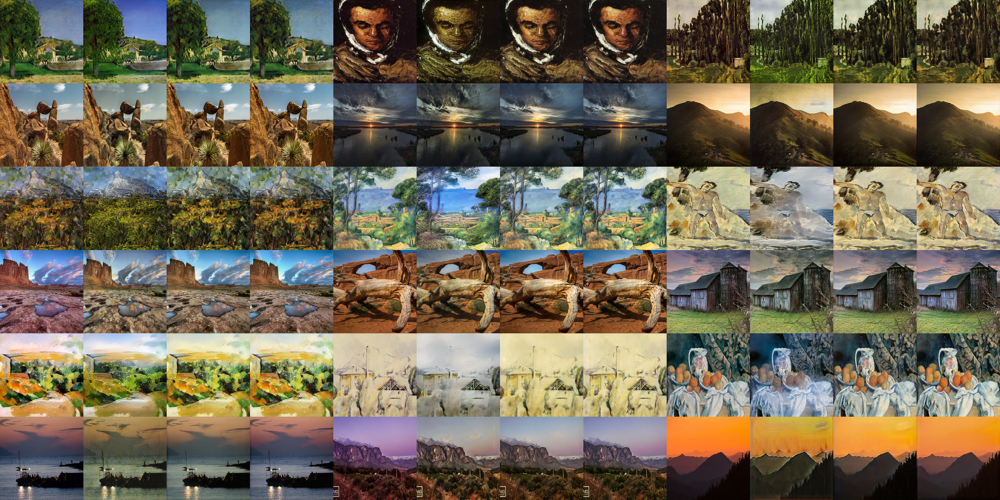
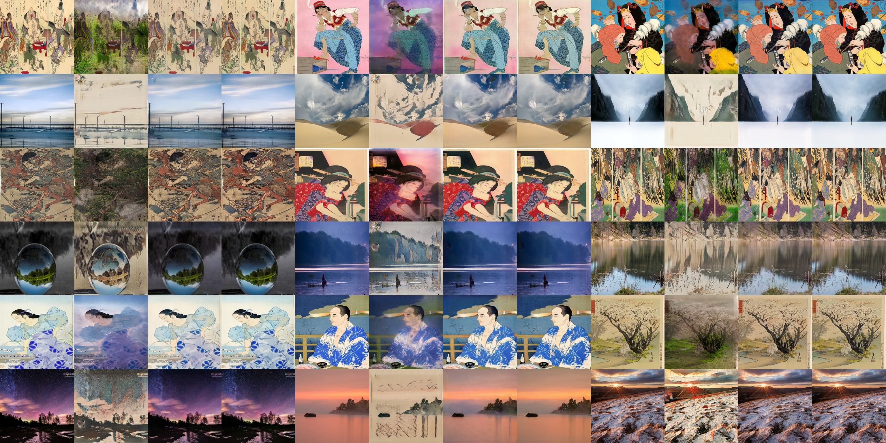
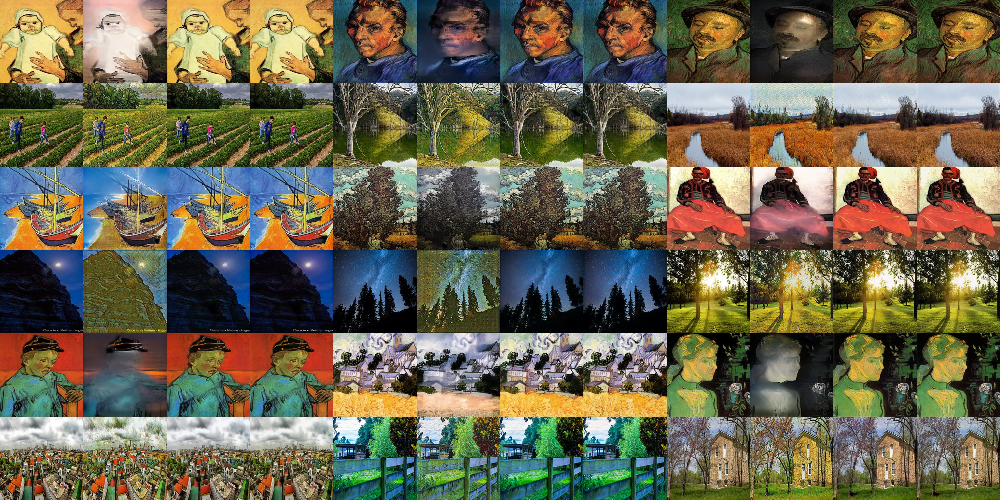
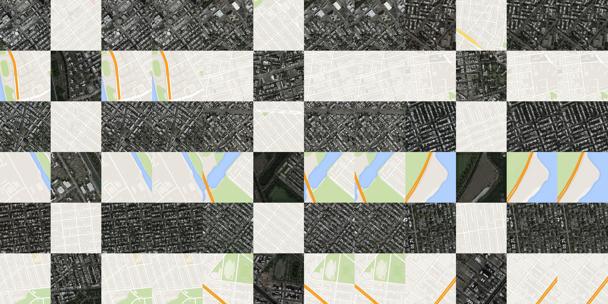
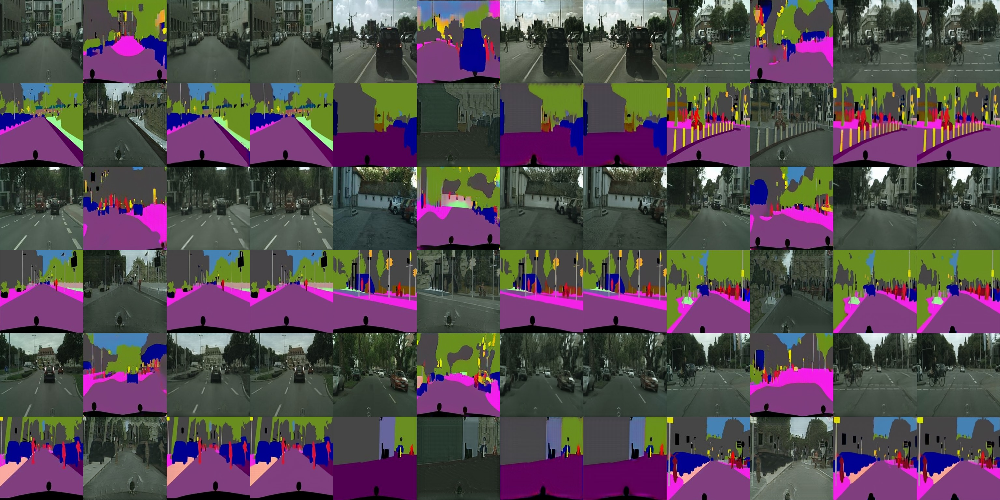
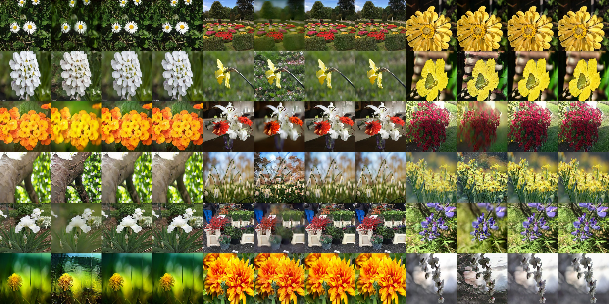

# chainer-cyclegan

[](https://travis-ci.org/wkentaro/chainer-cyclegan)

Chainer implementation of ["Unpaired Image-to-Image Translation using Cycle-Consistent Adversarial Network"](https://arxiv.org/abs/1703.10593).  
This is a faithful re-implementation of [the official PyTorch implementation](https://github.com/junyanz/pytorch-CycleGAN-and-pix2pix).


## Installation

```bash
git clone --recursive https://github.com/wkentaro/chainer-cyclegan.git
cd chainer-cyclegan

conda install -c menpo -y opencv
pip install .
```

or

```bash
pip install chainer-cyclegan
```


## Training

```bash
cd examples/cyclegan

# ./train.py <dataset> --gpu <gpu_id>
./train.py horse2zebra --gpu 0
```

## Results

### apple2orange



### summer2winter_yosemite



### horse2zebra



### monet2photo



### cezanne2photo



### ukiyoe2photo



### vangogh2photo



### maps



### cityscapes



### facades


### iphone2dslr_flower


