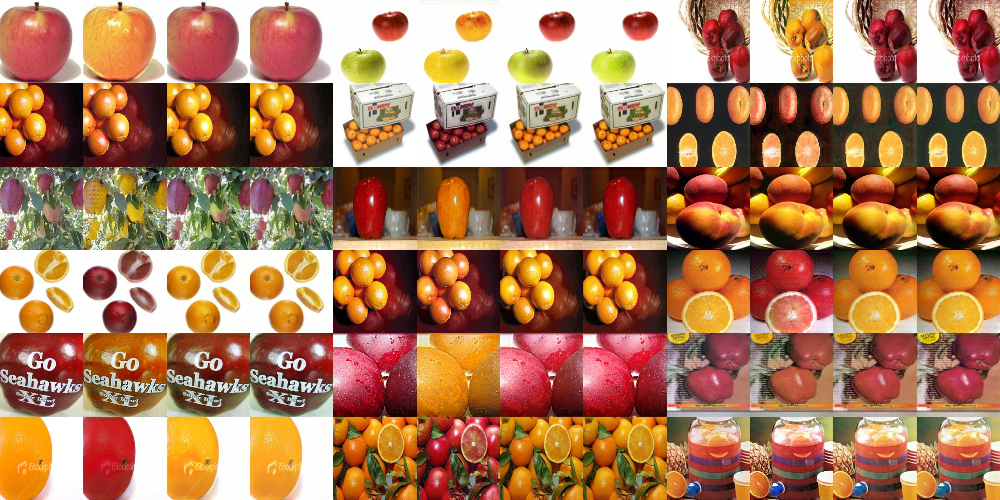
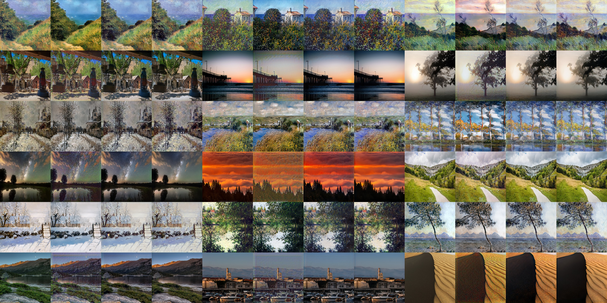
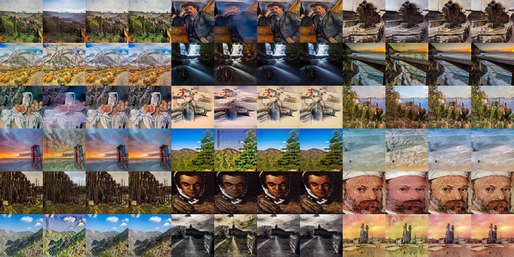
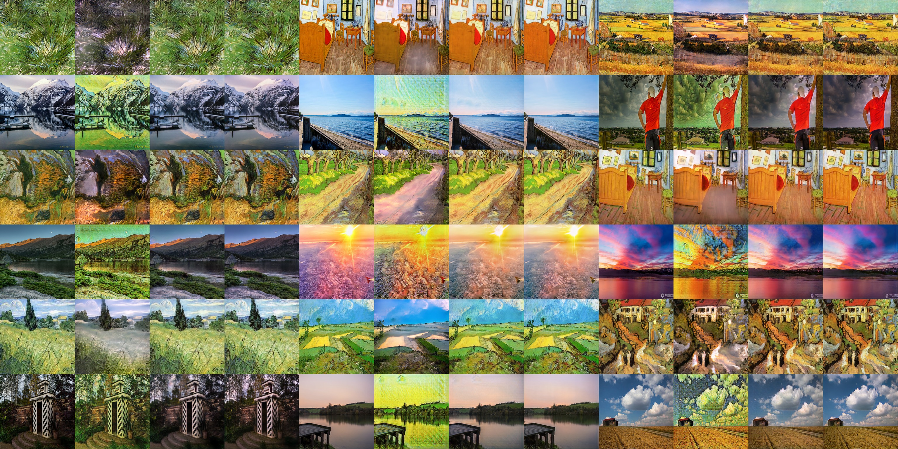
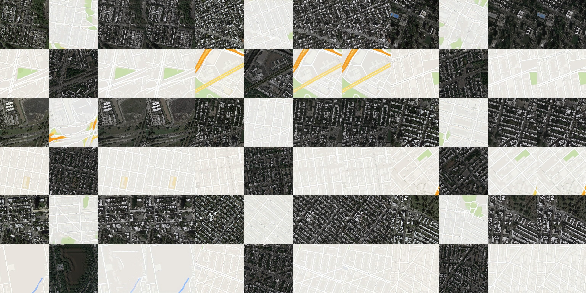
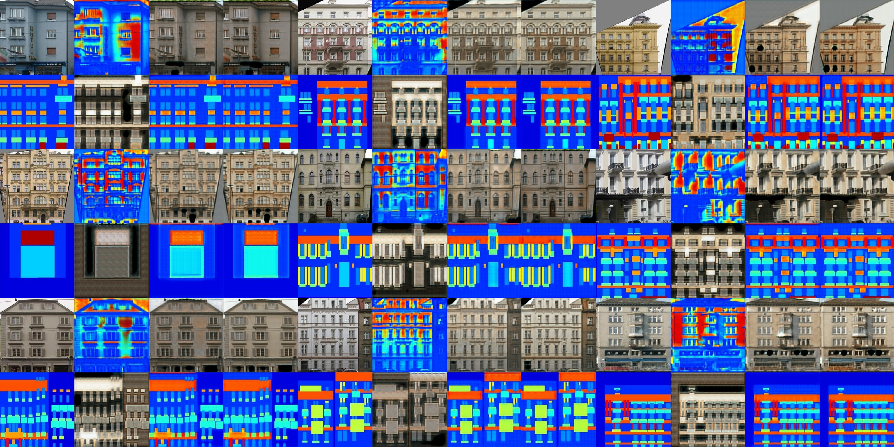
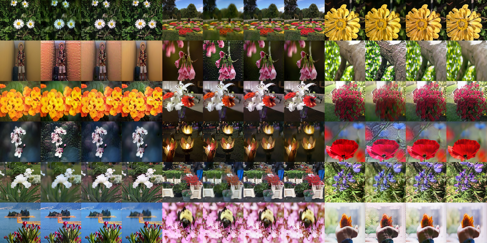

# CycleGAN

## Usage

```bash
# ./train.py <dataset> --gpu <gpu_id>
./train.py horse2zebra --gpu 0
```

### apple2orange



### summer2winter_yosemite


### horse2zebra


### monet2photo



### cezanne2photo



<!--
### ukiyoe2photo


-->

### vangogh2photo



### maps



### cityscapes


### facades



### iphone2dslr_flower


