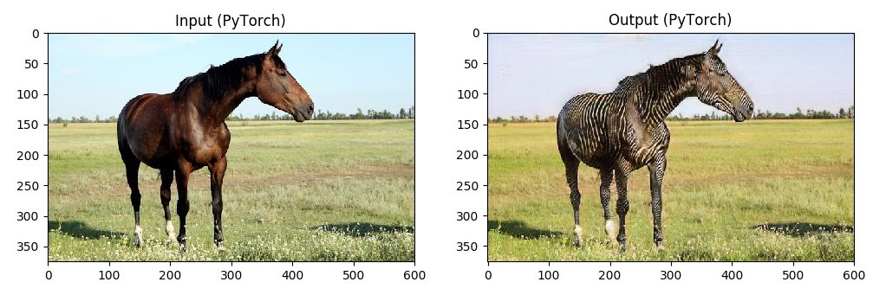
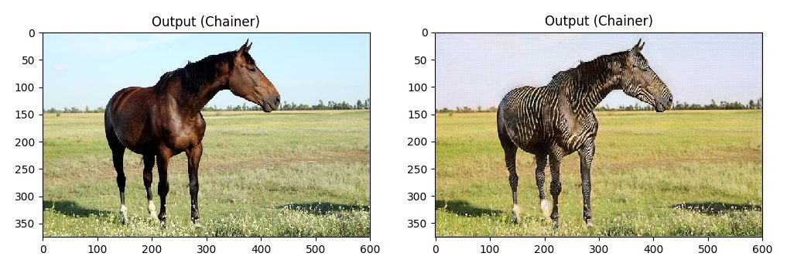

# horse2zebra

## Training

```bash
./train.py --gpu 0
```


## PyTorch to Chainer

```bash
# install pytorch
conda install -c soumith -y pytorch cuda80

./download_models.sh

./infer_pytorch.py

# To check G's re-implementation
./pytorch2chainer_G.py
./infer_chainer.py

# To check D's re-implementation
./generate_D_random_pth.py
./pytorch2chainer_D.py
```



